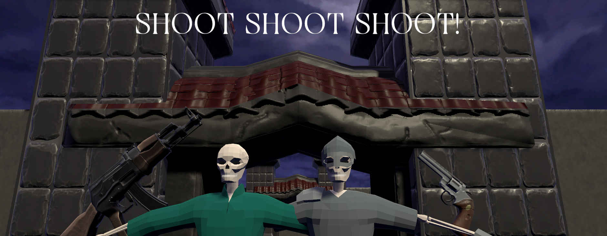

# Shot-Shot-Shot

# **` Shot-Shot-Shot`** is a classic shooter game made in unity. 

### Description

A simple game where you shoot skeletons and collect treasure chests

### Controls

Press E  or the left shoulder to pick up weapons.
Right click or Right trigger to shoot.
F or Right Shoulder to drop a weapon.
Right Click or X to interact with the menus
P or Select to pause

### Credits

* >Program by: Martin Concetti Rizzardi.
* >Helped by: Juan Pablo Varela Aloisio.

### Patterns use
* >Object pooling for bullets
  >Estate patter for enemy states

#### Contact information: 
* >Martin concetti: martinconcetti97@gmail.com
* >Itch.io: https://dread.itch.io/

